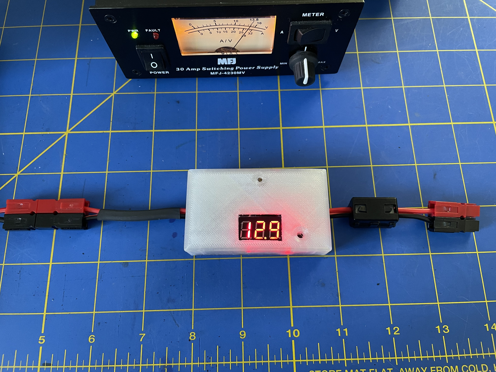
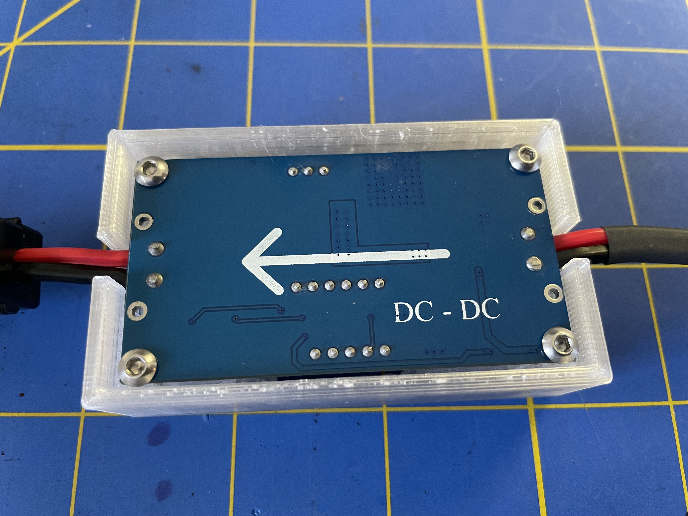

# Enclosure for DC-DC converter

A 3D-printer enclosure for the DC to DC buck converter.

The IN/OUT display switch button is accessible through the hole in the front of the enclosure. A small cylindrical button could be printed for convenience. The limit adjusting pot is also accessible through the small hole in the front of the enclosure. For my use case, I never adjust the limit voltage after setting it once at home. 

If you're printing with sufficiently transparrent fillament, you can probably leave the display cover portion of the enclosure in place. I had to cut it out, because it was diffusing the light from the 7-segment display so much that it was unreadable.

To assemble, I tapped the holes for M3-0.5 thread and secured the board in place with the M3x8 hex button head bolts. I did not print the optional bottom lid as I never use the converter in an environment where I'd worry about shorting anything on the button of the board. The board is recessed into the enclosure enough that the bolts do not stick below the enclosure.
